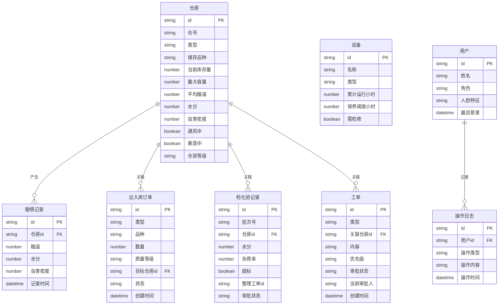

## 1. 架构设计

```mermaid
graph TB
    subgraph "前端层"
        "React 18 + TypeScript"
        "Three.js / R3F 3D引擎"
        "Zustand 状态管理"
        "Tailwind CSS 样式"
        "ECharts 数据可视化"
    end
    
    subgraph "数据层"
        "Mock数据服务"
        "本地状态管理"
        "SessionStorage 持久化"
    end
    
    "React 18 + TypeScript" --> "Three.js / R3F 3D引擎"
    "React 18 + TypeScript" --> "Zustand 状态管理"
    "React 18 + TypeScript" --> "Tailwind CSS 样式"
    "React 18 + TypeScript" --> "ECharts 数据可视化"
    "Zustand 状态管理" --> "Mock数据服务"
    "Zustand 状态管理" --> "本地状态管理"
    "Zustand 状态管理" --> "SessionStorage 持久化"
```

## 2. 技术说明

- 前端：React@18 + TypeScript + Vite + Tailwind CSS@3
- 初始化工具：vite-init
- 后端：无（纯前端，使用Mock数据模拟）
- 数据库：无（使用Zustand + SessionStorage管理状态和数据）
- 3D引擎：three + @react-three/fiber + @react-three/drei + @react-three/postprocessing
- 图表：echarts + echarts-for-react
- Excel导出：xlsx (SheetJS)
- 状态管理：zustand
- 路由：react-router-dom
- 图标：lucide-react

## 3. 路由定义

| 路由 | 用途 |
|------|------|
| / | 3D粮库全景总览页，默认首页，3D场景+仓房信息+粮情预警 |
| /dispatch | 智能出入库调度页，入库分配+出库匹配+路径动画 |
| /inspection | 检化验管理页，批次管理+超标标记+审批流程 |
| /fumigation | 虫害熏蒸管理页，虫害预警+熏蒸方案+审批+禁区显示 |
| /equipment | 设备运维管理页，设备监控+检修工单+备件通知 |
| /admin | 权限与日志页，用户管理+登录日志+操作审计 |
| /report | 日报导出页，日期选择+数据预览+Excel导出 |

## 4. 数据模型

### 4.1 数据模型定义



### 4.2 核心数据结构定义（TypeScript）

```typescript
interface Granary {
  id: string;
  code: string;
  type: 'flat' | 'silo';
  product: string;
  stock: number;
  capacity: number;
  avgTemp: number;
  moisture: number;
  pestDensity: number;
  ventilating: boolean;
  fumigating: boolean;
  level: 'normal' | 'low_temp' | 'quasi_low_temp';
  position: { x: number; y: number; z: number };
}

interface GrainRecord {
  id: string;
  granaryId: string;
  temperature: number;
  moisture: number;
  pestDensity: number;
  timestamp: string;
}

interface Order {
  id: string;
  type: 'in' | 'out';
  product: string;
  quantity: number;
  quality: 'premium' | 'standard' | 'general';
  targetGranaryId: string;
  status: 'pending' | 'approved' | 'dispatching' | 'completed';
  createdAt: string;
}

interface InspectionRecord {
  id: string;
  batchNo: string;
  granaryId: string;
  moisture: number;
  impurity: number;
  exceeded: boolean;
  workOrderId: string;
  approvalStatus: 'pending_inspector' | 'pending_director' | 'pending_leader' | 'approved' | 'rejected';
}

interface WorkOrder {
  id: string;
  type: 'drying' | 'cleaning' | 'fumigation' | 'maintenance' | 'expansion';
  granaryId: string;
  content: string;
  priority: 'low' | 'medium' | 'high';
  approvalStatus: string;
  currentApprover: string;
  createdAt: string;
}

interface Equipment {
  id: string;
  name: string;
  type: 'conveyor' | 'dryer' | 'fan';
  runningHours: number;
  maintenanceThreshold: number;
  needsMaintenance: boolean;
}

interface User {
  id: string;
  name: string;
  role: 'operator' | 'warehouse_director' | 'depot_director' | 'superior';
  lastLogin: string;
}

interface AlertNotification {
  id: string;
  type: 'temperature' | 'pest' | 'equipment' | 'dispatch';
  granaryId: string;
  message: string;
  severity: 'warning' | 'critical';
  timestamp: string;
  read: boolean;
}
```

## 5. 组件架构

```
src/
├── components/
│   ├── scene3d/              # 3D场景组件
│   │   ├── GrainDepotScene.tsx    # 主3D场景容器
│   │   ├── FlatWarehouse.tsx      # 平房仓3D模型
│   │   ├── SiloWarehouse.tsx      # 立筒仓3D模型
│   │   ├── DryingWorkshop.tsx     # 烘干车间3D模型
│   │   ├── ConveyorBridge.tsx     # 输送栈桥3D模型
│   │   ├── InspectionCenter.tsx   # 检化验中心3D模型
│   │   ├── DispatchCenter.tsx     # 调度中心3D模型
│   │   ├── GranaryLabel.tsx       # 仓房悬浮标签
│   │   ├── FanAnimation.tsx       # 风机旋转动画
│   │   ├── AirFlowParticles.tsx   # 气流粒子动画
│   │   ├── ConveyorPath.tsx       # 输送路径动画
│   │   ├── FumigationZone.tsx     # 熏蒸禁区球体
│   │   └── PestAlertEffect.tsx    # 虫害闪烁效果
│   ├── ui/                   # 通用UI组件
│   │   ├── AlertNotification.tsx  # 预警通知
│   │   ├── TrendChart.tsx         # 趋势曲线图
│   │   ├── ApprovalFlow.tsx       # 审批流程组件
│   │   ├── StatsCard.tsx          # 统计卡片
│   │   └── DataTable.tsx          # 数据表格
│   └── layout/
│       ├── Header.tsx             # 顶部导航栏
│       └── SidePanel.tsx          # 右侧信息面板
├── pages/
│   ├── OverviewPage.tsx           # 3D全景总览页
│   ├── DispatchPage.tsx           # 智能出入库调度页
│   ├── InspectionPage.tsx         # 检化验管理页
│   ├── FumigationPage.tsx         # 虫害熏蒸管理页
│   ├── EquipmentPage.tsx          # 设备运维管理页
│   ├── AdminPage.tsx              # 权限与日志页
│   └── ReportPage.tsx             # 日报导出页
├── stores/
│   ├── useGranaryStore.ts         # 仓房状态
│   ├── useOrderStore.ts           # 订单状态
│   ├── useInspectionStore.ts      # 检化验状态
│   ├── useWorkOrderStore.ts       # 工单状态
│   ├── useEquipmentStore.ts       # 设备状态
│   ├── useAuthStore.ts            # 认证状态
│   └── useAlertStore.ts           # 预警状态
├── data/
│   └── mockData.ts                # Mock数据
├── utils/
│   ├── dispatchAlgorithm.ts       # 智能调度算法
│   ├── excelExport.ts             # Excel导出工具
│   └── constants.ts               # 常量定义
├── App.tsx
└── main.tsx
```

## 6. 关键算法说明

### 6.1 入库最优仓房分配算法
- 根据品种确定仓房等级需求（优质稻→准低温仓、普通稻→常温仓、小麦→常温仓）
- 在同等级仓房中按剩余容量降序排列
- 选择容量最匹配且当前非熏蒸状态的仓房
- 若无匹配则生成扩容申请

### 6.2 出库最优仓房匹配算法
- 按品种和库存量筛选可用仓房
- 优先选择库存量满足订单且位置靠近出库口的仓房
- 考虑出库路径最短原则

### 6.3 粮温预警逻辑
- 实时监测各仓房粮温
- 粮温>30℃触发预警
- 自动启动对应仓房通风系统
- 粮温降至28℃以下自动停止通风
